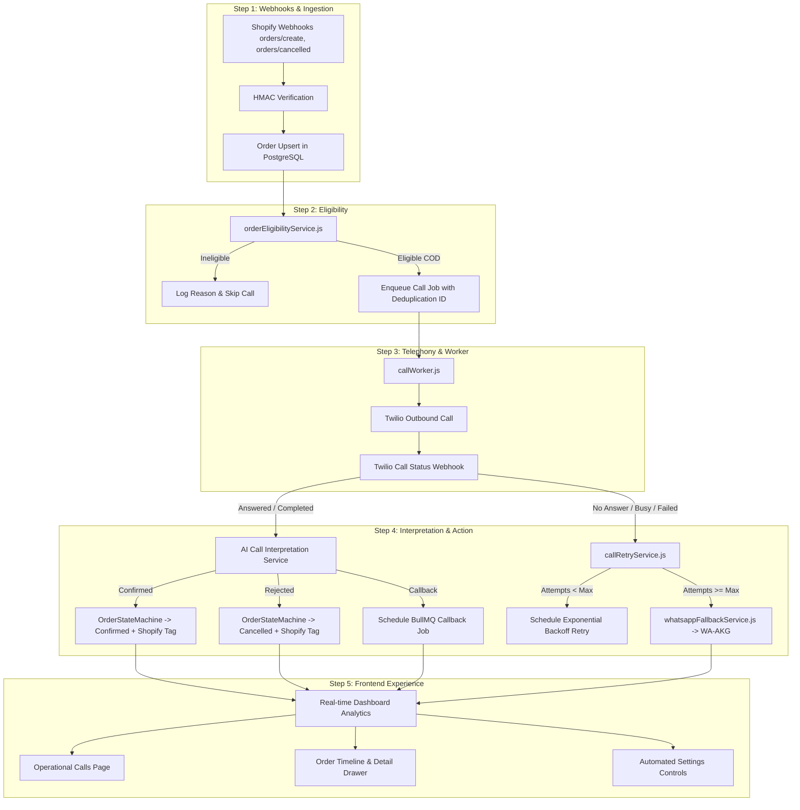

# PHASE 4 AUDIT: Automated COD Order-Confirmation Platform

**Project:** Dial Mate 2.0  
**Repository:** `https://github.com/brocode47/Updated-Dial-Mate-2.0`  
**Base Commit:** `2ba8c6f`  
**Target Store:** `0qwck2-s1.myshopify.com`  
**Audit Date:** 2026-10-01  

---

## Executive Summary

Dial Mate 2.0 has successfully completed Phase 3 and production verification. The system reliably connects to Shopify via OAuth, authenticates via JWT, stores merchant data in PostgreSQL, runs BullMQ on Redis, and displays real Shopify orders on the dashboard.

Phase 4 elevates Dial Mate into a **fully automated Cash on Delivery (COD) confirmation platform**. This audit reviews the entire existing codebase across `app/server`, `app/ai-engine`, `app/wa-akg`, and `app/src` to identify:
1. What is already implemented and must be preserved without regressions.
2. What components are missing or partially wired.
3. The precise, non-duplicative architectural plan to complete the end-to-end automated confirmation pipeline.

---

## Detailed System Component Audit

### 1. Shopify Webhooks & Ingestion
- **Current Status:** PARTIALLY IMPLEMENTED
- **Existing Files:**
  - `app/server/src/routes/webhooks.js` (handles `/webhooks/orders/create`, `/webhooks/orders/updated`, `/webhooks/call-status`, `/webhooks/wa-akg`)
  - `app/server/src/workers/webhookWorker.js` (processes `orders/create`, computes risk score, creates/updates `Order` record, adds job to `callQueue`)
  - `app/server/src/lib/webhookVerify.js` (HMAC verification)
- **What Is Missing:**
  - `orders/cancelled` webhook is not registered or handled (merchant or customer cancellations in Shopify should immediately cancel pending confirmation calls).
  - In `orders/updated`, orders are logged and ignored; changes in order financial status (e.g. paid online) or address updates are not synced.
  - Webhook registration in `registerWebhooksForShop` only registers `orders/create` and `orders/updated`. Needs `orders/cancelled`.
  - In `webhookWorker.js`, **order eligibility is missing**: any order with a phone number is unconditionally queued for outbound calling, ignoring whether it is COD, whether AI calling is enabled in store settings, operating hours, order status, or order value thresholds.
- **Recommended Implementation:**
  - Register and handle `orders/cancelled` to cancel queued calls or update state.
  - Integrate deterministic `orderEligibilityService` into `webhookWorker.js` before enqueueing calls.

---

### 2. Order Eligibility Engine
- **Current Status:** MISSING
- **Existing Files:**
  - `app/server/src/lib/risk.js` (only computes risk score based on high value and customer history)
  - `app/server/src/services/OrderStateMachine.js` (handles status transitions, but not initial eligibility)
- **What Is Missing:**
  - Dedicated deterministic `orderEligibilityService.js` that evaluates:
    1. **Payment method:** Is it COD? (e.g. "Cash on Delivery (COD)", "manual", or store configured COD gateways).
    2. **Phone validity:** Must have a valid phone number format (+92... or general E.164).
    3. **Order status:** Order must be unfulfilled, open, and not already confirmed or cancelled.
    4. **Merchant store settings:** Must have `aiCalling.enabled = true`.
    5. **Operating hours check:** Must be within merchant's configured calling hours (e.g. 09:00 - 21:00) unless overridden.
    6. **Maximum attempts:** Must not exceed merchant's max attempt limit.
    7. **Order value rules:** Respect minimum/maximum order value filters and excluded tags.
- **Recommended Implementation:**
  - Create `app/server/src/services/orderEligibilityService.js`.
  - Return structured contract: `{ eligible: boolean, reason: string, orderId: string, shopId: string, ruleBreakdown: object }`.
  - Use deterministic logic; never delegate eligibility to an LLM.

---

### 3. Call Queue & Background Execution
- **Current Status:** PARTIALLY IMPLEMENTED
- **Existing Files:**
  - `app/server/src/lib/queues.js` (`callQueue`, `webhookQueue`, `whatsappQueue`, `whatsappDeadLetterQueue`)
  - `app/server/src/workers/callWorker.js` (receives `initiate-call`, calls `triggerCall`)
  - `app/server/src/workers/index.js` (starts workers, concurrency: 5 for calls)
- **What Is Missing:**
  - `callWorker.js` directly calls `triggerCall` from `webhooks.js` (which plays hardcoded DTMF gather TwiML) instead of using the conversational AI / Twilio telephony dispatcher.
  - Job idempotency keying: BullMQ jobs must be uniquely keyed (`call-init-${orderId}-${shopId}`) to prevent duplicate calls when webhooks or sync requests repeat.
  - In-flight call locking: If an order is already being called or queued, duplicate triggers must be rejected.
  - Handling of `retry-call` and `callback` job types in `callWorker.js`.
- **Recommended Implementation:**
  - Enhance `callWorker.js` to support `initiate-call`, `retry-call`, and `callback` jobs.
  - Unify outbound call execution through a structured telephony service that checks eligibility, updates `Order.callStatus = 'calling'`, creates a `Call` record with `outcome = 'in-progress'`, and connects to Twilio.

---

### 4. Twilio Call Flow & Telephony
- **Current Status:** PARTIALLY IMPLEMENTED (DUAL IMPLEMENTATION EXISTS)
- **Existing Files:**
  - `app/server/src/calls/twilio.js` (`placeOutboundCall` helper)
  - `app/server/src/routes/twilio.js` (full bidirectional WebSocket audio streaming `/twilio/voice` + `/twilio/media` + AudioCodec + status handler `/twilio/status`)
  - `app/server/src/routes/webhooks.js` (simple IVR TwiML `/gather` + status handler `/webhooks/call-status` + `triggerCall`)
- **What Is Missing:**
  - Consolidation: Dial Mate currently has two separate Twilio outbound patterns:
    1. Keypad DTMF IVR in `webhooks.js` (`/gather` -> 1 for confirm, 2 for cancel).
    2. Live WebSocket Media Stream in `routes/twilio.js` (`/twilio/voice` -> connects to Gemini Live preview).
  - Status callbacks must reliably record all standard Twilio outcomes: `initiated`, `ringing`, `answered`, `completed`, `busy`, `no-answer`, `failed`.
  - In `routes/twilio.js`, status webhook only updates `Order.callStatus` and triggers simple retry, but does not update `Call` records, duration, recording URL, or trigger WhatsApp fallback when retries are exhausted.
- **Recommended Implementation:**
  - Support both modes dynamically: Conversational AI (Gemini Live Media Stream) as default, with reliable fallback to IVR if media stream/AI is unavailable.
  - Ensure status webhook writes directly to `Call` table (`durationSec`, `outcome`, `recordingUrl`), updates `Order`, and triggers the retry/fallback pipeline.

---

### 5. AI Call Interpretation & Structured Outcomes
- **Current Status:** PARTIALLY IMPLEMENTED
- **Existing Files:**
  - `app/server/src/integrations/ai/agent.js` (Gemini Live agent)
  - `app/server/src/integrations/ai/dispatcher.js` (dispatches `confirm_order`, `cancel_order`, `schedule_callback`, `request_human_transfer`)
  - `app/server/src/integrations/ai/tools.js` (tool declarations)
  - `app/ai-engine/app/agents/order_agent.py` (Python order confirmation & cancellation logic)
- **What Is Missing:**
  - Post-call transcript/utterance interpretation service: when a call completes (or recording/transcript is received), an interpretation engine evaluates the dialogue and classifies:
    ```json
    {
      "result": "CONFIRMED" | "REJECTED" | "CALLBACK_REQUESTED" | "NO_ANSWER" | "BUSY" | "FAILED" | "UNKNOWN",
      "confidence": 0.95,
      "language": "roman_urdu" | "urdu" | "english",
      "reason": "Customer explicitly confirmed order for delivery",
      "callbackTime": null
    }
    ```
  - Ambiguity protection: if confidence < 0.85 or classification is ambiguous, result is `UNKNOWN`, and order is flagged for human review (`HUMAN_REVIEW_NEEDED`) rather than blindly confirming.
- **Recommended Implementation:**
  - Create `app/server/src/services/aiCallInterpretationService.js` using the AI engine / LLM client with structured JSON output and strict validation.

---

### 6. Order Status Synchronization & State Machine
- **Current Status:** IMPLEMENTED & TESTED
- **Existing Files:**
  - `app/server/src/services/OrderStateMachine.js`
  - `app/server/src/integrations/shopify/orders.js` (`addOrderTag`, `removeOrderTag`, `cancelOrder`, `updateOrderNote`)
- **What Is Missing:**
  - Linking call outcomes directly to `OrderStateMachine`:
    - `CONFIRMED` -> `stateMachine.transition(OrderStatus.CONFIRMED)` -> tags Shopify with `COD_CONFIRMED` and sets DB status to `Confirmed`.
    - `REJECTED` -> `stateMachine.transition(OrderStatus.CANCELLED)` -> tags Shopify with `COD_CANCELLED` and sets DB status to `Cancelled`.
    - `HUMAN_REVIEW_NEEDED` -> `stateMachine.transition(OrderStatus.HUMAN_REQUIRED)` -> tags Shopify with `HUMAN_REVIEW_NEEDED`.
- **Recommended Implementation:**
  - Hook call outcome handler directly into `OrderStateMachine.transition()` so all side-effects (Shopify tag + PostgreSQL update) happen atomically with audit logging.

---

### 7. Automatic Retries & Scheduled Callbacks
- **Current Status:** PARTIALLY IMPLEMENTED
- **Existing Files:**
  - `app/server/src/routes/twilio.js` (contains hardcoded retry with 60s delay, max 2 retries)
  - `app/server/src/integrations/ai/dispatcher.js` (`schedule_callback` tool queues BullMQ job)
- **What Is Missing:**
  - Retry delays and max attempts are currently hardcoded in `twilio.js`. They must read from store settings (`Shop.settings.aiCalling.maxAttempts`, `Shop.settings.aiCalling.retryDelayMinutes`).
  - Callback jobs must be tracked in the database or order metadata so merchants can see scheduled callbacks in Dashboard and Orders table.
  - When all call attempts fail (`retryCount >= maxAttempts`), the system must trigger WhatsApp fallback instead of silently stopping.
- **Recommended Implementation:**
  - Create `app/server/src/services/callRetryService.js` that checks settings, increments `retryCount`, calculates delay with backoff, enqueues `retry-call` in BullMQ, and initiates WhatsApp fallback when exhausted.

---

### 8. WhatsApp Fallback via WA-AKG
- **Current Status:** PARTIALLY IMPLEMENTED
- **Existing Files:**
  - `app/server/src/workers/whatsappWorker.js` (hardened BullMQ worker processing inbound WhatsApp messages via Python AI Engine)
  - `app/server/src/integrations/whatsapp/client.js` (multi-tenant client sending messages via WA-AKG)
  - `app/server/src/routes/webhooks.js` (WA-AKG HMAC-verified webhook endpoint)
- **What Is Missing:**
  - Outbound WhatsApp fallback trigger: when phone call fails or is unanswered after max retries, system does not automatically send a WhatsApp message.
  - Multi-language templates for COD order confirmation via WhatsApp:
    - Roman Urdu: *"Assalam o Alaikum {customerName}! {shopName} se aap ke order #{orderNumber} (Tadaad: {itemCount}, Raqam: Rs {total}) ki confirmation darkaar hai. Bhejne ke liye 'Confirm' likhein ya cancel karne ke liye 'Cancel' reply karein."*
    - Urdu & English equivalents.
  - Inbound WhatsApp reply recognition: when customer replies "Confirm" or "Cancel", `order_agent.py` already supports `confirm_order` / `cancel_order`, but we need to ensure the customer reply updates the order status in PostgreSQL and tags Shopify!
- **Recommended Implementation:**
  - Add `sendWhatsAppFallback({ orderId, shopId })` to `services/whatsappFallbackService.js`.
  - When customer replies on WhatsApp, ensure the conversation resolves the order and triggers `OrderStateMachine`.

---

### 9. Dashboard Real-Time Status & Operational Visibility
- **Current Status:** WORKING (BASIC)
- **Existing Files:**
  - `app/server/src/routes/api.js` (`/dashboard/stats`)
  - `app/src/pages/DashboardPage.jsx`
- **What Is Missing:**
  - Detailed COD operational KPIs:
    - Today's Orders vs Today's Calls
    - Confirmed Orders & Confirmation Rate %
    - Rejected Orders & Cancellation Rate %
    - No-Answer / Unreachable Orders
    - Pending Confirmation Count
    - WhatsApp Fallbacks Sent
  - Live "Recent Call Activity" feed showing order number, customer name, outcome badge, duration, and timestamp.
  - Quick action to trigger instant call or open order drawer directly from dashboard feed.
- **Recommended Implementation:**
  - Expand `GET /api/dashboard/stats` to calculate today's metrics and return recent call activity.
  - Update `DashboardPage.jsx` with enhanced metric cards and recent call activity list.

---

### 10. Calls Page Operational Control Center
- **Current Status:** WORKING (READ-ONLY)
- **Existing Files:**
  - `app/src/pages/CallsPage.jsx`
  - `app/server/src/routes/api.js` (`GET /api/calls`)
- **What Is Missing:**
  - Real operational action: "Call Now" / "Retry Call" button in table and drawer that actually executes `POST /api/orders/:id/call`.
  - Filter by outcome: `All`, `Completed`, `Confirmed`, `Rejected`, `No Answer`, `Failed`, `Queued`.
  - Call Detail Drawer: showing customer phone, duration, recording URL audio player, full transcript, and associated order.
- **Recommended Implementation:**
  - Add operational buttons to `CallsPage.jsx` hooked to backend endpoints.
  - Connect audio player and transcript drawer with real data.

---

### 11. Order Detail Drawer & Timeline
- **Current Status:** BASIC DRAWER EXISTS
- **Existing Files:**
  - `app/src/components/OrderTable.jsx`
  - `app/src/pages/OrdersPage.jsx`
- **What Is Missing:**
  - Comprehensive order confirmation timeline:
    - Order Created (timestamp)
    - Confirmation Queued (timestamp)
    - Call Attempt 1 (timestamp, outcome)
    - Call Attempt 2 / Callback (timestamp, outcome)
    - WhatsApp Fallback Sent (timestamp)
    - Confirmed / Cancelled (timestamp, method: Call / WhatsApp / Manual)
  - Display customer phone, address, line items, payment gateway ("Cash on Delivery").
- **Recommended Implementation:**
  - Upgrade `OrderTable.jsx` detail drawer to render full operational timeline and call/WhatsApp history.

---

### 12. Settings & Merchant Configuration
- **Current Status:** BASIC PROFILE & BOT SETTINGS WORKING
- **Existing Files:**
  - `app/server/src/routes/api.js` (`GET /api/shop/settings`, `PUT /api/shop/settings`)
  - `app/src/pages/SettingsPage.jsx`
- **What Is Missing:**
  - Automation rules configuration:
    - AI Calling: Enable/Disable, Max attempts (1-5), Retry delay (minutes), Calling window (e.g. 09:00 - 21:00), Calling language (Roman Urdu / English / Urdu).
    - Order Rules: COD only (checkbox), Minimum order value (PKR), Excluded tags (comma-separated).
    - WhatsApp: Enable fallback (checkbox), Message template / language.
  - Persisted in PostgreSQL `Shop.settings` JSON column.
- **Recommended Implementation:**
  - Expand settings schema in `api.js` and add clean form controls in `SettingsPage.jsx`.

---

### 13. Idempotency & Tenant Isolation
- **Current Status:** PARTIALLY ENFORCED
- **Existing Files:**
  - `app/server/src/middleware/tenant.js`
  - `app/server/src/services/OrderStateMachine.js`
- **What Is Missing:**
  - BullMQ job deduplication keys for calls: `call-${shopId}-${orderId}` so concurrent webhooks/syncs cannot create double calls.
  - Database-level lock or status check (`where: { id: orderId, callStatus: { notIn: ['calling', 'queued'] } }`).
- **Recommended Implementation:**
  - Add deterministic BullMQ `jobId` across all call queues.
  - Enforce tenant verification in every background worker and route.

---

## Phase 4 Implementation Plan & Execution Order



### Planned Sequence of Steps:
1. **Audit Documentation:** Save `PHASE4-AUDIT.md` (this document).
2. **Order Eligibility Service:** Build deterministic `orderEligibilityService.js` checking COD, phone, operating hours, and settings.
3. **Shopify Webhooks Enhancement:** Complete `orders/create`, `orders/updated`, and `orders/cancelled` in `routes/webhooks.js` and `workers/webhookWorker.js` with eligibility integration.
4. **Call Worker & Telephony Dispatcher:** Upgrade `callWorker.js` and Twilio flow with structured outcomes and idempotency.
5. **AI Call Interpretation Service:** Implement structured outcome classification (`CONFIRMED`, `REJECTED`, `CALLBACK_REQUESTED`, `NO_ANSWER`, `BUSY`, `FAILED`, `UNKNOWN`).
6. **Order State Machine Integration:** Wire outcomes to `OrderStateMachine` with Shopify tagging (`COD_CONFIRMED`, `COD_CANCELLED`).
7. **Automated Retry & Callback Scheduler:** Implement configurable retries with backoff and persistent callbacks.
8. **WhatsApp Fallback Pipeline:** Implement automated WhatsApp fallback via WA-AKG when calls are unanswered.
9. **Settings & Automation Configuration:** Expand `Shop.settings` schema and frontend settings page.
10. **Frontend Dashboard, Calls & Orders Upgrades:** Add real-time KPIs, operational call triggers, and interactive timelines.
11. **Comprehensive Automated Tests:** Verify webhooks, eligibility, deduplication, retry, classification, and tenant isolation.
12. **Live Store Verification:** Verify against `0qwck2-s1.myshopify.com` without mock data.
